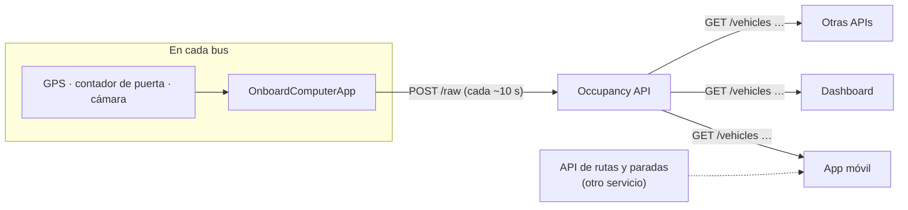
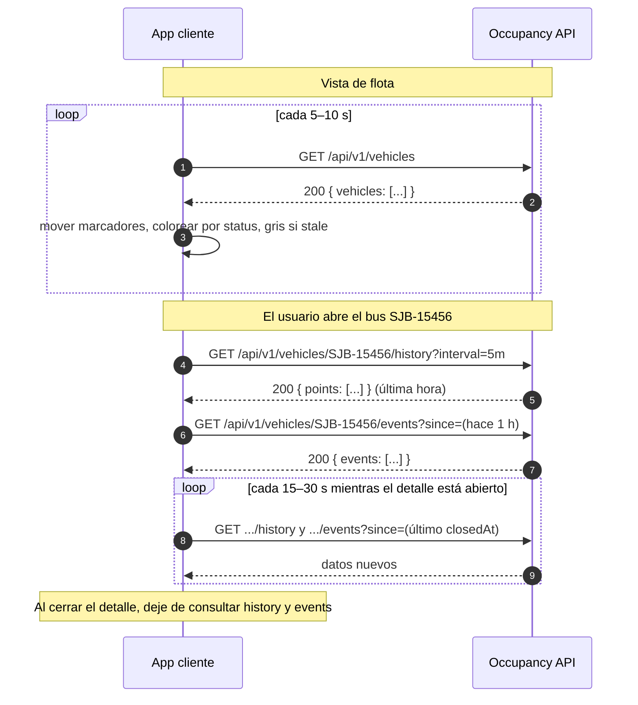

# Occupancy API

Sirve **solo el resultado** del procesamiento de sensores y video de cada bus: ocupación, eventos de abordaje y salida, y posición. Rutas, paradas, tarifas, lugares y planificación de viajes pertenecen a otras APIs, que pueden leer de esta.

Por ahora todo se guarda **en memoria** (se pierde al reiniciar). Un simulador (`MockFleet`) genera buses que se mueven y cambian de ocupación para que la app móvil y el dashboard puedan desarrollarse antes de que existan dispositivos reales.

> **Ver la API en acción:** con la API corriendo, abra el **[simulador de cliente](http://localhost:5189/simulate)** (`http://localhost:5189/simulate`). Hace las mismas llamadas que haría su app y muestra cada respuesta, la más reciente arriba. Permite elegir un bus.

**Contenido:** [Guía para apps cliente](#guía-para-apps-cliente) · [Ejecutar](#ejecutar) · [Endpoints](#endpoints) · [Convenciones](#convenciones) · [Datos crudos](#datos-crudos-post-raw) · [Configuración](#configuración) · [Flota simulada](#flota-simulada-autobuses-unidos-de-coronado)

## Guía para apps cliente

Esta sección es para quien construye una app que **muestra** la ocupación de los buses: app móvil, dashboard de operadores u otra API. Una app cliente solo **lee**; nunca envía datos.

### 1. Dónde encaja



- La Occupancy API responde **dónde está cada bus, cuánta gente lleva y quién subió o bajó**.
- **No** sirve rutas, paradas, horarios ni tarifas. Si su app los necesita, vienen de otra API; únalos por `vehicleId` (la placa).
- Los datos se actualizan cada 5–10 s por bus. Consultar más seguido no da datos más nuevos.

### 2. Integrarla en su app

1. **URL base.** En desarrollo: `http://localhost:5189`. Póngala en la configuración de su app, no en el código, porque cambiará al desplegar.
2. **Sin autenticación para leer.** Los `GET` no necesitan llave. CORS permite `GET` desde cualquier origen, así que una app web puede llamar directo desde el navegador.
3. **JSON** en UTF-8. Las horas vienen en ISO-8601 UTC (`2026-10-02T04:55:24.33+00:00`); conviértalas a la hora local para mostrarlas.
4. **Tipos.** El contrato está en `http://localhost:5189/openapi/v1.json`. **Atención:** ese documento declara `status` y `source` como enteros y los números como `integer | string`, pero la API envía nombres (`"FEW_SEATS_AVAILABLE"`) y números normales. Si genera tipos, corríjalos o escríbalos a mano como en [`src/occupancy-reference-web/src/types/occupancy.ts`](../occupancy-reference-web/src/types/occupancy.ts).
5. **Ejemplo funcionando:** la [app web de referencia](../occupancy-reference-web/README.md) (React + TypeScript) hace todo lo de esta guía: mapa, lista, detalle, historial y eventos.

### 3. El flujo de llamadas

Una app típica tiene dos momentos: la **vista de flota** (mapa o lista de todos los buses) y el **detalle de un bus** (cuando el usuario toca uno).



| Pantalla | Llamada | Cada cuánto |
|---|---|---|
| Mapa o lista de flota | `GET /api/v1/vehicles` | 5–10 s |
| Un solo bus (por ejemplo, "mi bus") sin la flota | `GET /api/v1/vehicles/{vehicleId}` | 5–10 s |
| Gráfico de ocupación de un bus | `GET /api/v1/vehicles/{vehicleId}/history` | 15–60 s, solo con el detalle abierto |
| Abordajes y salidas de un bus | `GET /api/v1/vehicles/{vehicleId}/events?since=` | 15–30 s, solo con el detalle abierto |

Reglas prácticas:

- **No solape peticiones.** Programe la siguiente consulta cuando llegue la respuesta (`setTimeout` después de responder, no `setInterval`).
- **Si una consulta falla, conserve los últimos datos** y muestre un aviso; no vacíe la pantalla.
- **Pause las consultas** cuando la app pasa a segundo plano.

### 4. Cada llamada, con ejemplos

#### `GET /api/v1/vehicles`: todos los buses

```bash
curl http://localhost:5189/api/v1/vehicles
```

```json
{
  "vehicles": [
    {
      "vehicleId": "SJB-10356",
      "asOf": "2026-10-01T20:52:03.91+00:00",
      "stale": false,
      "location": { "lat": 9.958059, "lon": -84.039263, "speedKmh": 21, "headingDeg": 215 },
      "occupancy": {
        "passengerCount": 12,
        "capacity": 90,
        "percent": 13,
        "status": "MANY_SEATS_AVAILABLE",
        "source": "SIMULATED",
        "measuredAt": "2026-10-01T20:52:03.91+00:00"
      },
      "device": { "online": true, "lastSeen": "2026-10-01T20:52:03.91+00:00", "cameraOnline": true, "firmware": "sim-2.0" }
    }
  ]
}
```

`location` y `occupancy` pueden ser `null` si el bus todavía no envió ese dato. `headingDeg` es `null` cuando el bus está detenido.

#### `GET /api/v1/vehicles/{vehicleId}`: un bus

```bash
curl http://localhost:5189/api/v1/vehicles/SJB-10356
```

Devuelve un solo objeto con la misma forma que cada elemento de `vehicles`. La placa se normaliza: `sjb 10356`, `SJB_10356` y `SJB-10356` son el mismo bus. Un bus que nunca reportó da **404**.

#### `GET /api/v1/vehicles/{vehicleId}/history`: ocupación en el tiempo

| Parámetro | Por defecto | Notas |
|---|---|---|
| `from` | `to` menos 1 hora | ISO-8601 |
| `to` | ahora | ISO-8601 |
| `interval` | `5m` | número + `s`, `m` o `h`; mínimo `10s`. Rango máximo: 7 días |

```bash
curl "http://localhost:5189/api/v1/vehicles/SJB-10356/history?interval=5m"
```

```json
{
  "vehicleId": "SJB-10356",
  "from": "2026-10-01T19:52:13.25+00:00",
  "to": "2026-10-01T20:52:13.25+00:00",
  "interval": "5m",
  "points": [
    { "time": "2026-10-01T19:52:13.25+00:00", "passengerCount": 20, "peakPassengerCount": 23, "capacity": 90, "percent": 22 },
    { "time": "2026-10-01T19:57:13.25+00:00", "passengerCount": 10, "peakPassengerCount": 20, "capacity": 90, "percent": 11 }
  ]
}
```

`passengerCount` es el último valor del intervalo y `peakPassengerCount` el máximo. Para un gráfico, dibuje `passengerCount` como línea y `peakPassengerCount` como banda.

#### `GET /api/v1/vehicles/{vehicleId}/events?since=`: abordajes y salidas

```bash
curl "http://localhost:5189/api/v1/vehicles/SJB-10356/events?since=2026-10-01T19:52:00Z"
```

```json
{
  "vehicleId": "SJB-10356",
  "events": [
    {
      "door": 1,
      "boardings": 1,
      "alightings": 3,
      "location": { "lat": 9.939451, "lon": -84.065842, "speedKmh": 0 },
      "openedAt": "2026-10-01T19:54:28.04+00:00",
      "closedAt": "2026-10-01T19:54:48.04+00:00",
      "occupancyAfter": 20
    }
  ]
}
```

Los eventos vienen del más viejo al más nuevo. **Envíe siempre `since`:** sin él, la API devuelve todos los eventos guardados del bus. Para consultar solo lo nuevo, use como `since` el `closedAt` del último evento recibido.

### 5. Mostrar los datos

| `status` | Significado | Color sugerido |
|---|---|---|
| `EMPTY` | Vacío | verde |
| `MANY_SEATS_AVAILABLE` | Muchos asientos | verde claro |
| `FEW_SEATS_AVAILABLE` | Pocos asientos | amarillo |
| `STANDING_ROOM_ONLY` | Solo de pie | naranja |
| `CRUSHED_STANDING_ROOM_ONLY` | Muy lleno | rojo |
| `FULL` | Lleno | rojo oscuro |

- **`stale: true`**: el bus no reporta hace más de 60 s. Muéstrelo en gris y sin flecha de dirección; su posición y ocupación ya no son actuales.
- **"Hace x s"**: calcúlelo con `device.lastSeen`.
- **Dirección**: `headingDeg` en grados desde el norte, en sentido horario (`0` = norte, `90` = este). Rote el ícono o una flecha; si es `null`, el bus está detenido o no hay rumbo.
- **`source`**: de dónde salió el número (`DOOR_COUNTER_3D`, `CABIN_CAMERA`, `DOOR_CAMERA`, `SIMULATED`). Útil en un dashboard para saber qué tan confiable es.
- **`percent`** ya viene calculado (`passengerCount / capacity`). Puede pasar de 100 en un bus sobrecargado.

### 6. Errores

Los errores vienen en formato [Problem Details](https://www.rfc-editor.org/rfc/rfc9457); `title` explica qué pasó y se puede mostrar o registrar:

```json
{ "type": "https://tools.ietf.org/html/rfc9110#section-15.5.5", "title": "Bus XXX-0000 has not reported any data.", "status": 404 }
```

| Código | Cuándo | Qué hacer |
|---|---|---|
| 200 | Todo bien | |
| 400 | Parámetro inválido, por ejemplo `interval=5s` (mínimo `10s`) | Corregir la llamada |
| 404 | El bus nunca reportó | Mostrar "sin datos"; no reintentar en bucle |
| sin respuesta / 5xx | API caída o red | Conservar los últimos datos, avisar y reintentar en el siguiente ciclo |

### 7. Ejemplo completo (TypeScript)

Consulta la flota cada 5 s sin solapar peticiones y conserva los últimos datos si falla:

```ts
const API = 'http://localhost:5189' // desde la configuración de su app

type OccupancyStatus =
  | 'EMPTY' | 'MANY_SEATS_AVAILABLE' | 'FEW_SEATS_AVAILABLE'
  | 'STANDING_ROOM_ONLY' | 'CRUSHED_STANDING_ROOM_ONLY' | 'FULL'

interface VehicleState {
  vehicleId: string
  stale: boolean
  location: { lat: number; lon: number; speedKmh?: number | null; headingDeg?: number | null } | null
  occupancy: { passengerCount: number; capacity: number; percent: number; status: OccupancyStatus; source: string } | null
  device: { online: boolean; lastSeen: string }
}

async function getJson<T>(path: string): Promise<T> {
  const response = await fetch(`${API}${path}`)
  if (!response.ok) {
    const problem = await response.json().catch(() => null)
    throw new Error(problem?.title ?? `HTTP ${response.status}`)
  }
  return response.json()
}

function pollFleet(onData: (vehicles: VehicleState[]) => void, onError: (message: string) => void) {
  let stopped = false
  async function tick() {
    try {
      const { vehicles } = await getJson<{ vehicles: VehicleState[] }>('/api/v1/vehicles')
      onData(vehicles)
    } catch (error) {
      onError((error as Error).message) // la pantalla conserva los datos anteriores
    }
    if (!stopped) setTimeout(tick, 5000)
  }
  tick()
  return () => { stopped = true } // llamar al salir de la pantalla
}

// Detalle de un bus: historial de la última hora y eventos de la última hora.
const busId = encodeURIComponent('SJB-10356')
const history = await getJson(`/api/v1/vehicles/${busId}/history?interval=5m`)
const since = new Date(Date.now() - 60 * 60 * 1000).toISOString()
const events = await getJson(`/api/v1/vehicles/${busId}/events?since=${encodeURIComponent(since)}`)
```

Cualquier cliente HTTP sirve (Kotlin, Swift, Flutter, C#): son `GET` simples que devuelven JSON.

### Lista de verificación

- [ ] La URL base viene de configuración.
- [ ] La flota se consulta cada 5–10 s, sin peticiones solapadas.
- [ ] `history` y `events` solo se consultan con el detalle abierto, y `events` siempre con `since`.
- [ ] Los buses `stale` se muestran en gris.
- [ ] `location`, `occupancy` y `headingDeg` pueden ser `null`.
- [ ] Un error conserva los últimos datos y muestra un aviso.
- [ ] Las horas se muestran en hora local.
- [ ] Probado contra el [simulador de cliente](http://localhost:5189/simulate) y la flota simulada.

## Ejecutar

```powershell
dotnet run --project src/Innova.Occupancy.Api
```

- API: `http://localhost:5189/api/v1/vehicles`
- Contrato OpenAPI (para generar tipos en la app): `http://localhost:5189/openapi/v1.json`
- Ejemplos listos: `Innova.Occupancy.Api.http`
- Simulador de cliente: [`http://localhost:5189/simulate`](http://localhost:5189/simulate). Consulta los endpoints de lectura igual que una app cliente y muestra cada respuesta, la más reciente arriba. Se puede elegir un bus (`?bus=SJB-15456`): entonces consulta ese bus cada 5 s y su historial y eventos cada 15 s. Activo en Development; en otro ambiente se activa con `ClientDemo:Enabled=true`.

## Endpoints

**Lectura** (app móvil, dashboard de operadores, otras APIs):

| # | Endpoint | Qué devuelve | Sensor de origen (supuesto) | Requerimiento |
|---|---|---|---|---|
| 1 | `GET /api/v1/vehicles` | Último estado de todos los buses: ocupación, posición, frescura | Contador 3D cenital de puerta; cámara CCTV interior + IA; GPS | RF-04; diagrama pasos 6–7 |
| 2 | `GET /api/v1/vehicles/{vehicleId}` | Último estado de un bus | Igual que #1 | RF-04; diagrama paso 6 |
| 3 | `GET /api/v1/vehicles/{vehicleId}/events?since=` | Abordajes y salidas por puerta, con hora y lugar | Contador 3D cenital de puerta; GPS | RF-02; RF-07/RF-08 |
| 4 | `GET /api/v1/vehicles/{vehicleId}/history?from=&to=&interval=` | Ocupación en el tiempo (último valor y pico por intervalo) | Igual que #1, almacenado | RF-05; RF-06 |

**Escritura** (solo el equipo a bordo de cada bus):

| # | Endpoint | Qué recibe | Sensor de origen (supuesto) | Requerimiento |
|---|---|---|---|---|
| 5 | `POST /api/v1/vehicles/{vehicleId}/observations` | Resultado ya procesado: conteos, ocupación, GPS, estado del equipo | Todos los anteriores, combinados por la computadora edge del bus | RF-02; RF-03 |
| 6 | `POST /api/v1/vehicles/{vehicleId}/raw` | **Datos crudos** del OnboardComputerApp: GPS en NMEA 0183, eventos del contador de puerta y resultados de la API de inferencia de visión. Esta API hace todos los cálculos. | GPS; contador 3D de puerta; API de visión (sin imágenes) | RF-02; RF-03; RF-07; RF-08 |

## Convenciones

- **`vehicleId`** es la placa o el número de flota, configurado en el equipo del bus. Se normaliza a mayúsculas con guiones: `sjb 8754`, `SJB_8754` y `SJB-8754` son el mismo bus.
- **`status`** usa los niveles de GTFS-Realtime (`EMPTY`, `MANY_SEATS_AVAILABLE`, `FEW_SEATS_AVAILABLE`, `STANDING_ROOM_ONLY`, `CRUSHED_STANDING_ROOM_ONLY`, `FULL`). Los umbrales por porcentaje están en `OccupancyApi:Thresholds`.
- **`source`** indica de dónde viene el número: `DOOR_COUNTER_3D`, `CABIN_CAMERA`, `DOOR_CAMERA` o `SIMULATED`.
- **`location.headingDeg`** es la dirección de avance en grados desde el norte verdadero, en sentido horario (`0` = norte, `90` = este). Es opcional: viene vacío cuando el bus está detenido (menos de 2 km/h) o el GPS no da rumbo.
- **`stale: true`** cuando el bus no reporta hace más de `OccupancyApi:StaleAfterSeconds` (60 s).
- **Horas** en ISO-8601 con zona horaria; la API responde en UTC.
- **Errores** en formato Problem Details: 400 datos inválidos, 401 llave de dispositivo inválida, 404 bus sin datos.
- Un mensaje más viejo que el último recibido no reemplaza la posición ni la ocupación actual, pero sí cuenta en eventos e historial.

## Datos crudos (`POST /raw`)

El [**OnboardComputerApp**](../Innova.OnboardComputer.App/README.md) (en el bus o en un servidor) envía un mensaje cada ~10 s y al cerrarse las puertas. Cada parte conserva el formato de su fuente, así que reemplazar un sensor simulado por uno real solo requiere un adaptador:

| Parte | Formato | Adaptador |
|---|---|---|
| `gps` | `NMEA-0183`: oraciones `$--RMC` y `$--GGA` de cualquier receptor, con checksum | `NmeaParser` |
| `doorCounter` | `apc-door-events-v1`: `DOOR_OPENED`, `COUNT` (`in`/`out`) y `DOOR_CLOSED` por puerta. No hay estándar universal; otro fabricante = otro adaptador (`IDoorCounterAdapter`) | `ApcDoorEventsV1Adapter` |
| `vision` | Resultados de la API de inferencia por cuadro: `trackId`, `class` (`sitting`/`standing`), `score`, `box`. Nunca imágenes | `VisionReading` |

Cálculos de la API:

- **Posición:** la última lectura GPS válida (se descartan oraciones con checksum incorrecto o sin señal). La velocidad y el rumbo (`headingDeg`) vienen del campo *course over ground* de `$--RMC`; si una `$--GGA` llega con la misma hora, se usa la RMC porque la GGA no trae ninguno de los dos.
- **Puertas:** cada apertura y cierre produce un evento con abordajes y salidas; una puerta puede abrirse en un mensaje y cerrarse en el siguiente.
- **Pasajeros:** conteo acumulado del contador de puerta. La cámara no puede ver más personas de las que hay a bordo, así que si ve más, el conteo se corrige hacia arriba (`source: CABIN_CAMERA`). Un bus solo con cámara usa lo que la cámara ve (mediana de los cuadros del mensaje).
- **`sequence`:** número creciente por bus. Un mensaje reenviado tras un error de red se acepta pero no se cuenta dos veces (`duplicate: true`).
- **Capacidad:** viene del registro de flota (`Fleet:RegistryFile`); un bus no registrado recibe 404.
- Cuando un bus envía datos crudos, el simulador deja de moverlo durante 2 minutos.

Ejemplo completo en `Innova.Occupancy.Api.http`.

## Configuración

| Clave | Uso |
|---|---|
| `Fleet:RegistryFile` | Registro de flota: buses y su capacidad (`MockData/coronado-fleet.json`). |
| `MockFleet:Enabled` | Activa la flota simulada (ver abajo). Desactivar cuando haya dispositivos reales. |
| `MockFleet:FleetFile` | Archivo con la flota y los corredores simulados (`MockData/coronado-fleet.json`). |
| `MockFleet:WarmUpMinutes` | Minutos simulados al arrancar, para que la ocupación, los eventos y el historial ya tengan datos (60). |
| `MockFleet:TimeOfDayOverride` | Hora de Costa Rica cuya demanda se simula, por ejemplo `07:30`, para mostrar la hora pico en cualquier momento. Vacío = reloj real. |
| `Ingestion:DeviceKeys:{vehicleId}` | Llave de cada bus, enviada en el header `X-Device-Key`. Si no hay llaves configuradas, cualquiera puede enviar observaciones: solo para desarrollo. |
| `OccupancyApi:HistoryRetentionHours` | Horas de historial en memoria (24). |

Las llaves no deben guardarse en `appsettings.json`; use variables de entorno, por ejemplo `Ingestion__DeviceKeys__SJB-8754`.

## Flota simulada: Autobuses Unidos de Coronado

Los datos simulados representan a **Autobuses Unidos de Coronado S.A.** con su modelo troncal-alimentador:

- **43 buses:** 27 troncales en la **Ruta 142** (San José ↔ San Isidro de Coronado) y 16 alimentadores en **10 ramales** que llevan pasajeros a la terminal de Coronado.
- **Unos 28 000 pasajeros al día.** Una prueba simula 24 horas completas y verifica el total (±20 %; hoy da unos 27 000) y que los buses troncales se llenen en ambas horas pico.
- **Horas pico:** de mañana hacia San José y hacia la terminal; de tarde de regreso. Los buses van más lentos en hora pico, se detienen unos 20 s por parada y descansan 5 min en cada terminal.
- **Servicio:** toda la flota en hora pico, cerca de la mitad al mediodía y en la noche, ninguna de 11 p. m. a 5 a. m. (los buses estacionados siguen reportando, vacíos).
- **`SJB-7090` está fuera de servicio:** reporta una vez y luego aparece como `stale`.

> **Datos ficticios.** Los totales (43 buses, 27 + 16, 10 ramales, ~28 000 pasajeros/día) vienen de la investigación del equipo y no están verificados. Las placas, capacidades (90 troncal, 50 alimentador) y los ramales marcados "por definir" son inventados. Las rutas del archivo solo mueven la simulación: esta API nunca sirve rutas.

**Recorridos:** siguen calles reales de OpenStreetMap, calculadas con OSRM desde la Parroquia San Isidro Labrador (Coronado) hasta el centro de cada destino; la Ruta 142 va Parque Central (San José) → Guadalupe → Ipís → Coronado. Se aproximan a los recorridos reales del operador, pero no los copian. El trazado completo está en `data/routes/coronado-routes-osm.geojson` (puede verse arrastrándolo a geojson.io). Datos de mapa © colaboradores de OpenStreetMap (ODbL).
