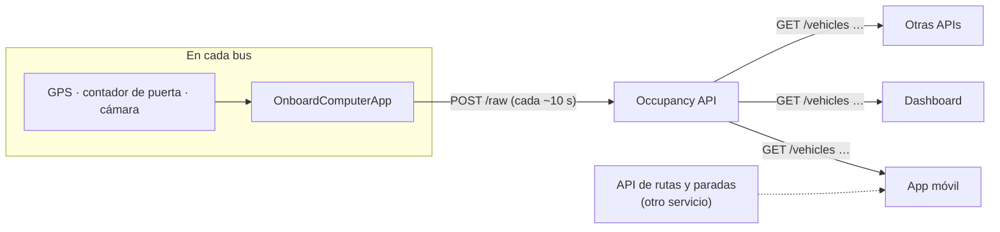
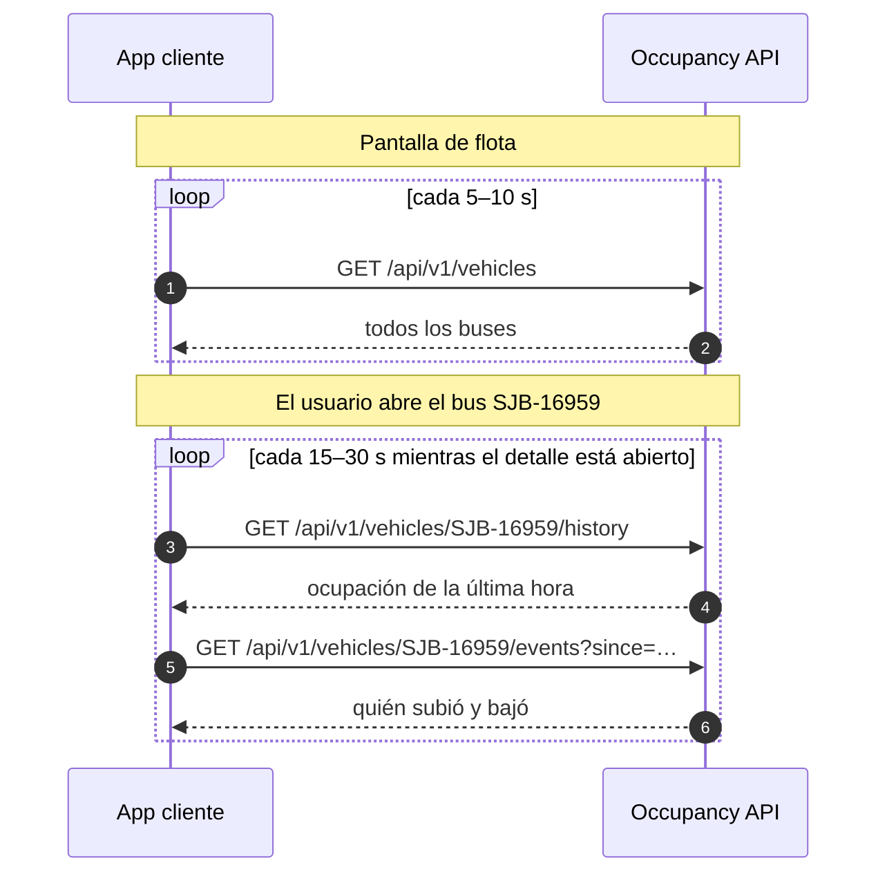
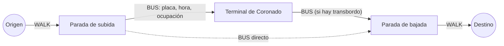

# Occupancy API

Sirve el resultado del procesamiento de sensores y video de cada bus (ocupación, eventos de abordaje y salida, y posición) y, con esos datos en vivo, **planifica viajes en la línea de Coronado**: qué bus tomar desde donde está el usuario hasta su destino. Tarifas, lugares y búsqueda de direcciones pertenecen a otras APIs.

Por ahora todo se guarda **en memoria** (se pierde al reiniciar). Un simulador (`MockFleet`) genera buses que se mueven y cambian de ocupación para que la app móvil y el dashboard puedan desarrollarse antes de que existan dispositivos reales.

> **Ver la API en acción:** abra el **[simulador de cliente](https://lg0618pp-002-site2.htempurl.com/simulate)** (`https://lg0618pp-002-site2.htempurl.com/simulate`). Hace las mismas llamadas que haría su app y muestra cada respuesta, la más reciente arriba. Permite elegir un bus.
>
> **Planificar un viaje:** el **[simulador de rutas](https://lg0618pp-002-site2.htempurl.com/simulateroute)** (`https://lg0618pp-002-site2.htempurl.com/simulateroute`) recibe origen y destino como `lat,lon` (trae 10 ejemplos), llama a `GET /api/v1/trips/plan` como lo haría la app y muestra la respuesta.

**Contenido:** [Guía para apps cliente](#guía-para-apps-cliente) · [Ejecutar](#ejecutar) · [Endpoints](#endpoints) · [Convenciones](#convenciones) · [Datos raw](#datos-raw-post-raw) · [Configuración](#configuración) · [Flota simulada](#flota-simulada-autobuses-unidos-de-coronado)

## Guía para apps cliente

Para quien construye una app que **muestra** la ocupación de los buses (app móvil, dashboard u otra API). Una app cliente solo **lee**; nunca envía datos.

### 1. Cómo funciona



- La API responde **dónde está cada bus, cuánta gente lleva y quién subió o bajó**. No sirve rutas, paradas ni horarios.
- Los datos de cada bus se actualizan cada 5–10 s.
- **URL base:** `https://lg0618pp-002-site2.htempurl.com` (sitio de demostración, temporal), o `http://localhost:5189` si corre la API en su computadora. Póngala en la configuración de su app.
- **Sin llave** para leer, respuestas en **JSON**, horas en **UTC**. Una app web puede llamarla directo desde el navegador (CORS abierto para `GET`).

Una app típica tiene dos pantallas: la **flota** (mapa o lista) y el **detalle de un bus**.



| Pantalla | Llamada | Cada cuánto |
|---|---|---|
| Mapa o lista de buses | `GET /api/v1/vehicles` | 5–10 s |
| Un solo bus, sin la flota | `GET /api/v1/vehicles/{placa}` | 5–10 s |
| Gráfico de ocupación de un bus | `GET /api/v1/vehicles/{placa}/history` | 15–60 s, solo con el detalle abierto |
| Subidas y bajadas de un bus | `GET /api/v1/vehicles/{placa}/events?since=` | 15–30 s, solo con el detalle abierto |
| Cómo llegar de A a B | `GET /api/v1/trips/plan?from=lat,lon&to=lat,lon` | Al pedir la ruta y cada 10–15 s mientras el usuario va a la parada |

Para ver estas llamadas en vivo, abra el [simulador de cliente](https://lg0618pp-002-site2.htempurl.com/simulate).

### 2. Conectarse desde una app de Visual Studio (C#)

Esta sección es para apps hechas en **Visual Studio** con .NET: **.NET MAUI** (móvil), Blazor, WPF o consola. No hace falta instalar ningún paquete NuGet: `HttpClient` y `System.Net.Http.Json` vienen con .NET.

1. **Cree el proyecto.** Para móvil, elija la plantilla **.NET MAUI App**.
2. **Guarde la dirección de la API en un solo lugar:**
   ```csharp
   public static class OccupancyApi
   {
       public static readonly HttpClient Http = new() { BaseAddress = new Uri("https://lg0618pp-002-site2.htempurl.com") };
   }
   ```
   Use **https**: Android e iOS bloquean `http` por defecto, y con https no hay que configurar nada.
3. **Copie los tipos** (los `record` al final del ejemplo de abajo) en un archivo, por ejemplo `Models.cs`. Reflejan el JSON de la API.
4. **Llámela** donde cargue los datos, por ejemplo en una página. Agregue `using System.Net.Http.Json;` arriba:
   ```csharp
   var fleet = await OccupancyApi.Http.GetFromJsonAsync<VehicleList>("/api/v1/vehicles");
   ```
   En MAUI, después del `await` el código sigue en el hilo de la pantalla, así que puede actualizar los controles directamente.
5. **Actualice cada 5–10 s** con un `PeriodicTimer`, como en el ejemplo. Deténgalo cuando el usuario sale de la página y envuelva la llamada en `try/catch` para conservar los últimos datos si falla la red.

Bueno saber:

- La primera llamada después de un rato sin uso puede tardar varios segundos mientras el servidor arranca la API; las siguientes tardan menos de un segundo.
- Si alguna vez prueba contra la API en su propia computadora desde el emulador de Android, la dirección es `http://10.0.2.2:5189`, no `localhost`.
- Para un mapa en MAUI existe `Microsoft.Maui.Controls.Maps`; en Android necesita una llave de Google Maps.
- **Probar sin escribir código:** abra [`Innova.Occupancy.Api.http`](Innova.Occupancy.Api.http) en Visual Studio, cambie la primera línea por `@host = https://lg0618pp-002-site2.htempurl.com` y haga clic en **Send request** sobre cualquier `GET`.
- Si genera el cliente desde `openapi/v1.json` (Connected Services, NSwag), revise `status` y `source`: el documento los declara como números, pero la API envía texto (`"MANY_SEATS_AVAILABLE"`). Los `record` de abajo ya los tratan como `string`.

Ejemplo completo (funciona tal cual en una app de consola):

```csharp
using System.Net.Http.Json;

var api = new HttpClient { BaseAddress = new Uri("https://lg0618pp-002-site2.htempurl.com") };

// 1. Todos los buses
var fleet = await api.GetFromJsonAsync<VehicleList>("/api/v1/vehicles");
foreach (var bus in fleet!.Vehicles)
{
    Console.WriteLine($"{bus.VehicleId}: {bus.Occupancy?.PassengerCount}/{bus.Occupancy?.Capacity} " +
                      $"{bus.Occupancy?.Status} en ({bus.Location?.Lat}, {bus.Location?.Lon})");
}

// 2. Un bus: historial y eventos de la última hora
var history = await api.GetFromJsonAsync<OccupancyHistory>("/api/v1/vehicles/SJB-16959/history?interval=5m");
var since = Uri.EscapeDataString(DateTimeOffset.UtcNow.AddHours(-1).ToString("O"));
var events = await api.GetFromJsonAsync<VehicleEventList>($"/api/v1/vehicles/SJB-16959/events?since={since}");
Console.WriteLine($"{history!.Points.Count} puntos de historial, {events!.Events.Count} eventos de puerta");

// 3. Consultar la flota cada 5 s (en una app, actualice la pantalla en lugar de escribir en consola)
using var timer = new PeriodicTimer(TimeSpan.FromSeconds(5));
while (await timer.WaitForNextTickAsync())
{
    try
    {
        fleet = await api.GetFromJsonAsync<VehicleList>("/api/v1/vehicles");
        Console.WriteLine($"{DateTime.Now:T}: {fleet!.Vehicles.Count} buses");
    }
    catch (HttpRequestException error)
    {
        Console.WriteLine($"Sin conexión, se conservan los últimos datos: {error.Message}");
    }
}

// Tipos que reflejan el JSON de la API
public record VehicleList(List<VehicleState> Vehicles);
public record VehicleState(string VehicleId, DateTimeOffset AsOf, bool Stale,
    GeoLocation? Location, OccupancySnapshot? Occupancy, DeviceHealth Device);
public record GeoLocation(double Lat, double Lon, double? SpeedKmh, double? HeadingDeg);
public record OccupancySnapshot(int PassengerCount, int Capacity, int Percent,
    string Status, string Source, DateTimeOffset MeasuredAt);
public record DeviceHealth(bool Online, DateTimeOffset LastSeen, bool? CameraOnline, string? Firmware);
public record OccupancyHistory(string VehicleId, DateTimeOffset From, DateTimeOffset To, string Interval,
    List<HistoryPoint> Points);
public record HistoryPoint(DateTimeOffset Time, int PassengerCount, int PeakPassengerCount, int Capacity, int Percent);
public record VehicleEventList(string VehicleId, List<DoorEvent> Events);
public record DoorEvent(int Door, int Boardings, int Alightings, GeoLocation? Location,
    DateTimeOffset OpenedAt, DateTimeOffset ClosedAt, int? OccupancyAfter);
```

### 3. Conectarse desde React o TypeScript

Para apps web (React, Angular, Vue) o React Native. El navegador puede llamar a la API directamente: CORS permite `GET` desde cualquier origen.

Consulta la flota cada 5 s sin solapar peticiones y conserva los últimos datos si falla:

```ts
const API = 'https://lg0618pp-002-site2.htempurl.com' // desde la configuración de su app

type OccupancyStatus =
  | 'EMPTY' | 'MANY_SEATS_AVAILABLE' | 'FEW_SEATS_AVAILABLE'
  | 'STANDING_ROOM_ONLY' | 'CRUSHED_STANDING_ROOM_ONLY' | 'FULL'

interface VehicleState {
  vehicleId: string
  stale: boolean
  location: { lat: number; lon: number; speedKmh?: number | null; headingDeg?: number | null } | null
  occupancy: { passengerCount: number; capacity: number; percent: number; status: OccupancyStatus; source: string } | null
  device: { online: boolean; lastSeen: string }
}

async function getJson<T>(path: string): Promise<T> {
  const response = await fetch(`${API}${path}`)
  if (!response.ok) {
    const problem = await response.json().catch(() => null)
    throw new Error(problem?.title ?? `HTTP ${response.status}`)
  }
  return response.json()
}

function pollFleet(onData: (vehicles: VehicleState[]) => void, onError: (message: string) => void) {
  let stopped = false
  async function tick() {
    try {
      const { vehicles } = await getJson<{ vehicles: VehicleState[] }>('/api/v1/vehicles')
      onData(vehicles)
    } catch (error) {
      onError((error as Error).message) // la pantalla conserva los datos anteriores
    }
    if (!stopped) setTimeout(tick, 5000) // la siguiente consulta, solo después de la respuesta
  }
  tick()
  return () => { stopped = true } // llamar al salir de la pantalla
}

// Detalle de un bus: historial y eventos de la última hora.
const busId = encodeURIComponent('SJB-16959')
const history = await getJson(`/api/v1/vehicles/${busId}/history?interval=5m`)
const since = new Date(Date.now() - 60 * 60 * 1000).toISOString()
const events = await getJson(`/api/v1/vehicles/${busId}/events?since=${encodeURIComponent(since)}`)
```

### 4. Probar con curl: cada llamada, con ejemplos

```bash
# Todos los buses
curl https://lg0618pp-002-site2.htempurl.com/api/v1/vehicles

# Un bus (la placa puede ir en minúsculas o con espacio: sjb 16959)
curl https://lg0618pp-002-site2.htempurl.com/api/v1/vehicles/SJB-16959

# Ocupación de la última hora, en intervalos de 5 minutos
curl "https://lg0618pp-002-site2.htempurl.com/api/v1/vehicles/SJB-16959/history?interval=5m"

# Subidas y bajadas desde una hora dada (envíe siempre since)
curl "https://lg0618pp-002-site2.htempurl.com/api/v1/vehicles/SJB-16959/events?since=2026-10-01T19:52:00Z"

# Cómo llegar de Ipís al centro de San José
curl "https://lg0618pp-002-site2.htempurl.com/api/v1/trips/plan?from=9.9620,-84.0300&to=9.9330,-84.0790"
```

Así responde `GET /api/v1/vehicles` (un bus de la lista):

```json
{
  "vehicles": [
    {
      "vehicleId": "SJB-10356",
      "asOf": "2026-10-01T20:52:03.91+00:00",
      "stale": false,
      "location": { "lat": 9.958059, "lon": -84.039263, "speedKmh": 21, "headingDeg": 215 },
      "occupancy": {
        "passengerCount": 12, "capacity": 90, "percent": 13,
        "status": "MANY_SEATS_AVAILABLE", "source": "SIMULATED",
        "measuredAt": "2026-10-01T20:52:03.91+00:00"
      },
      "device": { "online": true, "lastSeen": "2026-10-01T20:52:03.91+00:00", "cameraOnline": true, "firmware": "sim-2.0" }
    }
  ]
}
```

### 5. Campos de cada endpoint

#### `GET /api/v1/vehicles` y `GET /api/v1/vehicles/{placa}`

`/vehicles` devuelve `{ "vehicles": [ … ] }`; `/vehicles/{placa}` devuelve un solo bus. Cada bus tiene:

| Campo | Tipo | Qué es |
|---|---|---|
| `vehicleId` | texto | Placa del bus, por ejemplo `SJB-10356` |
| `asOf` | fecha y hora | Hora del último dato recibido |
| `stale` | sí/no | `true` si el bus no reporta hace más de 60 s: muéstrelo en gris |
| `location.lat` | número | Latitud GPS |
| `location.lon` | número | Longitud GPS |
| `location.speedKmh` | número o vacío | Velocidad en km/h |
| `location.headingDeg` | número o vacío | Dirección de avance: 0 = norte, 90 = este, 180 = sur, 270 = oeste. Vacío si está detenido |
| `trip.routeId` | texto o vacío | Ruta que está haciendo: `R142` (troncal) o `R142-01`…`R142-10` (ramales). `trip` viene vacío si el bus no está en servicio |
| `trip.direction` | texto | `INBOUND` (hacia San José, o hacia la terminal en los ramales) u `OUTBOUND` (en sentido contrario) |
| `occupancy.passengerCount` | entero | Pasajeros a bordo |
| `occupancy.capacity` | entero | Capacidad del bus |
| `occupancy.percent` | entero | Porcentaje de ocupación (puede pasar de 100) |
| `occupancy.status` | texto | Nivel de ocupación (tabla de abajo) |
| `occupancy.source` | texto | De dónde viene el número: `DOOR_COUNTER_3D`, `CABIN_CAMERA`, `DOOR_CAMERA` o `SIMULATED` |
| `occupancy.measuredAt` | fecha y hora | Cuándo se midió |
| `device.online` | sí/no | Si el equipo del bus está conectado |
| `device.lastSeen` | fecha y hora | Último contacto del equipo; úselo para "hace x s" |
| `device.cameraOnline` | sí/no o vacío | Si la cámara funciona |
| `device.firmware` | texto o vacío | Versión del software del equipo |

`location` y `occupancy` pueden venir vacíos (`null`) si el bus todavía no envió ese dato.

| `status` | Significado | Color sugerido |
|---|---|---|
| `EMPTY` | Vacío | verde |
| `MANY_SEATS_AVAILABLE` | Muchos asientos | verde claro |
| `FEW_SEATS_AVAILABLE` | Pocos asientos | amarillo |
| `STANDING_ROOM_ONLY` | Solo de pie | naranja |
| `CRUSHED_STANDING_ROOM_ONLY` | Muy lleno | rojo |
| `FULL` | Lleno | rojo oscuro |

#### `GET /api/v1/vehicles/{placa}/history`

| Parámetro | Por defecto | Qué es |
|---|---|---|
| `from` | una hora antes de `to` | Inicio, en ISO-8601 |
| `to` | ahora | Fin, en ISO-8601 |
| `interval` | `5m` | Tamaño de cada intervalo: número + `s`, `m` o `h`. Mínimo `10s`; rango máximo 7 días |

Devuelve `vehicleId`, `from`, `to`, `interval` y una lista `points`, uno por intervalo:

| Campo | Tipo | Qué es |
|---|---|---|
| `time` | fecha y hora | Inicio del intervalo |
| `passengerCount` | entero | Pasajeros al final del intervalo |
| `peakPassengerCount` | entero | Máximo de pasajeros en el intervalo |
| `capacity` | entero | Capacidad del bus |
| `percent` | entero | Porcentaje de ocupación |

#### `GET /api/v1/vehicles/{placa}/events?since=`

| Parámetro | Por defecto | Qué es |
|---|---|---|
| `since` | ninguno: devuelve todo lo guardado | Solo eventos cerrados después de esta hora (ISO-8601). Envíelo siempre; para traer solo lo nuevo, use el `closedAt` del último evento |

Devuelve `vehicleId` y una lista `events`, del más viejo al más nuevo:

| Campo | Tipo | Qué es |
|---|---|---|
| `door` | entero | Número de puerta |
| `boardings` | entero | Personas que subieron |
| `alightings` | entero | Personas que bajaron |
| `location` | lat, lon o vacío | Dónde estaba el bus |
| `openedAt` | fecha y hora | Cuándo se abrió la puerta |
| `closedAt` | fecha y hora | Cuándo se cerró |
| `occupancyAfter` | entero o vacío | Pasajeros a bordo al cerrar la puerta |

#### `GET /api/v1/trips/plan`

Opciones para ir de `from` a `to` en la línea de Coronado, la mejor primero. Cada opción combina caminatas y buses **específicos** (con placa y ocupación en vivo), con a lo sumo un transbordo (en la práctica, en la terminal de Coronado). Solo se ofrece un bus si el usuario alcanza a caminar hasta la parada, con margen, antes de que pase.



| Parámetro | Por defecto | Qué es |
|---|---|---|
| `from`, `to` | obligatorios | `lat,lon`, por ejemplo `9.9620,-84.0300`: el GPS del teléfono y el destino de la búsqueda de direcciones |
| `walkKmh` | `4.5` | Velocidad al caminar (1–8) |
| `maxWalkMeters` | `1000` | Máximo a caminar hasta una parada (100–3000) |
| `marginSeconds` | `60` | Margen para llegar a la parada antes que el bus (0–600) |

Devuelve `from`, `to`, `generatedAt`, `message` (por qué no hay opciones, si es el caso) y `options`:

| Campo | Tipo | Qué es |
|---|---|---|
| `departAt`, `arriveAt` | fecha y hora | Salida (ahora) y llegada al destino |
| `durationMinutes` | número | Duración total |
| `transfers` | entero | 0 = directo, 1 = un transbordo |
| `warnings` | lista de textos | Avisos para mostrar: bus lleno, margen ajustado, espera larga, bus en la terminal |
| `legs[]` | lista | Tramos en orden |
| `legs[].type` | texto | `WALK` o `BUS` |
| `legs[].from`, `legs[].to` | lugar | `name`, `lat`, `lon` y `stopId` si es una parada |
| `legs[].departAt`, `legs[].arriveAt` | fecha y hora | En un `BUS`, `departAt` es cuando el bus pasa por la parada de subida |
| `legs[].minutes`, `legs[].meters` | números | Duración y distancia del tramo |
| `legs[].bus.vehicleId` | texto | Placa del bus que hay que tomar |
| `legs[].bus.routeName`, `headsign`, `direction` | textos | "Ruta 142" hacia "San José", `INBOUND` |
| `legs[].bus.waitMinutes` | número | Espera en la parada después de llegar caminando |
| `legs[].bus.stops` | entero | Paradas que recorre hasta bajarse |
| `legs[].bus.vehicle` | objeto | El bus ahora: `location`, `speedKmh`, `headingDeg`, `passengerCount`, `capacity`, `percent`, `status`, `distanceToStopMeters` |
| `legs[].bus.laterBuses` | lista | Los siguientes buses por esa parada (`vehicleId`, `arriveAt`, ocupación), por si el primero viene lleno |
| `legs[].bus.path` | lista de lat, lon | El recorrido del tramo, para dibujarlo en el mapa |

Pídalo de nuevo cada 10–15 s mientras el usuario va a la parada: los buses se mueven y las horas cambian.

#### Errores

Vienen en formato [Problem Details](https://www.rfc-editor.org/rfc/rfc9457); el campo `title` explica qué pasó.

| Código | Cuándo | Qué hacer |
|---|---|---|
| 400 | Parámetro inválido, por ejemplo `interval=5s` | Corregir la llamada |
| 404 | La placa no existe o nunca reportó | Mostrar "sin datos" |
| sin respuesta / 5xx | API caída o sin red | Conservar los últimos datos, avisar y reintentar |

## Ejecutar

```powershell
dotnet run --project src/Innova.Occupancy.Api
```

- API: `http://localhost:5189/api/v1/vehicles`
- Contrato OpenAPI (para generar tipos en la app): `http://localhost:5189/openapi/v1.json`
- Ejemplos listos: `Innova.Occupancy.Api.http`
- Simulador de cliente: [`http://localhost:5189/simulate`](http://localhost:5189/simulate). Consulta los endpoints de lectura igual que una app cliente y muestra cada respuesta, la más reciente arriba. Se puede elegir un bus (`?bus=SJB-15456`): entonces consulta ese bus cada 5 s y su historial y eventos cada 15 s. Activo en Development; en otro ambiente se activa con `ClientDemo:Enabled=true`.
- Simulador de rutas: [`http://localhost:5189/simulateroute`](http://localhost:5189/simulateroute). Origen y destino como `lat,lon`, con 10 ejemplos de la línea de Coronado; llama a `GET /api/v1/trips/plan` y muestra la respuesta, la más reciente arriba. Se activa igual que el simulador de cliente.

## Endpoints

**Lectura** (app móvil, dashboard de operadores, otras APIs):

| # | Endpoint | Qué devuelve | Sensor de origen (supuesto) | Requerimiento |
|---|---|---|---|---|
| 1 | `GET /api/v1/vehicles` | Último estado de todos los buses: ocupación, posición, frescura | Contador 3D cenital de puerta; cámara CCTV interior + IA; GPS | RF-04; diagrama pasos 6–7 |
| 2 | `GET /api/v1/vehicles/{vehicleId}` | Último estado de un bus | Igual que #1 | RF-04; diagrama paso 6 |
| 3 | `GET /api/v1/vehicles/{vehicleId}/events?since=` | Abordajes y salidas por puerta, con hora y lugar | Contador 3D cenital de puerta; GPS | RF-02; RF-07/RF-08 |
| 4 | `GET /api/v1/vehicles/{vehicleId}/history?from=&to=&interval=` | Ocupación en el tiempo (último valor y pico por intervalo) | Igual que #1, almacenado | RF-05; RF-06 |
| 4b | `GET /api/v1/trips/plan?from=&to=` | Cómo llegar de A a B en la línea de Coronado: caminatas, el bus exacto que conviene tomar, transbordo y hora de llegada | Posición y ocupación en vivo de #1 | Planificación de viajes |

**Escritura** (solo el equipo a bordo de cada bus):

| # | Endpoint | Qué recibe | Sensor de origen (supuesto) | Requerimiento |
|---|---|---|---|---|
| 5 | `POST /api/v1/vehicles/{vehicleId}/observations` | Resultado ya procesado: conteos, ocupación, GPS, estado del equipo | Todos los anteriores, combinados por la computadora edge del bus | RF-02; RF-03 |
| 6 | `POST /api/v1/vehicles/{vehicleId}/raw` | **Datos raw** del OnboardComputerApp: GPS en NMEA 0183, eventos del contador de puerta y resultados de la API de inferencia de visión. Esta API hace todos los cálculos. | GPS; contador 3D de puerta; API de visión (sin imágenes) | RF-02; RF-03; RF-07; RF-08 |

## Convenciones

- **`vehicleId`** es la placa o el número de flota, configurado en el equipo del bus. Se normaliza a mayúsculas con guiones: `sjb 8754`, `SJB_8754` y `SJB-8754` son el mismo bus.
- **`status`** usa los niveles de GTFS-Realtime (`EMPTY`, `MANY_SEATS_AVAILABLE`, `FEW_SEATS_AVAILABLE`, `STANDING_ROOM_ONLY`, `CRUSHED_STANDING_ROOM_ONLY`, `FULL`). Los umbrales por porcentaje están en `OccupancyApi:Thresholds`.
- **`source`** indica de dónde viene el número: `DOOR_COUNTER_3D`, `CABIN_CAMERA`, `DOOR_CAMERA` o `SIMULATED`.
- **`location.headingDeg`** es la dirección de avance en grados desde el norte verdadero, en sentido horario (`0` = norte, `90` = este). Es opcional: viene vacío cuando el bus está detenido (menos de 2 km/h) o el GPS no da rumbo.
- **`stale: true`** cuando el bus no reporta hace más de `OccupancyApi:StaleAfterSeconds` (60 s).
- **Horas** en ISO-8601 con zona horaria; la API responde en UTC.
- **Errores** en formato Problem Details: 400 datos inválidos, 401 llave de dispositivo inválida, 404 bus sin datos.
- Un mensaje más viejo que el último recibido no reemplaza la posición ni la ocupación actual, pero sí cuenta en eventos e historial.

## Datos raw (`POST /raw`)

El [**OnboardComputerApp**](../Innova.OnboardComputer.App/README.md) (en el bus o en un servidor) envía un mensaje cada ~10 s y al cerrarse las puertas. Cada parte conserva el formato de su fuente, así que reemplazar un sensor simulado por uno real solo requiere un adaptador:

| Parte | Formato | Adaptador |
|---|---|---|
| `gps` | `NMEA-0183`: oraciones `$--RMC` y `$--GGA` de cualquier receptor, con checksum | `NmeaParser` |
| `doorCounter` | `apc-door-events-v1`: `DOOR_OPENED`, `COUNT` (`in`/`out`) y `DOOR_CLOSED` por puerta. No hay estándar universal; otro fabricante = otro adaptador (`IDoorCounterAdapter`) | `ApcDoorEventsV1Adapter` |
| `vision` | Resultados de la API de inferencia por cuadro: `trackId`, `class` (`sitting`/`standing`), `score`, `box`. Nunca imágenes | `VisionReading` |

Cálculos de la API:

- **Posición:** la última lectura GPS válida (se descartan oraciones con checksum incorrecto o sin señal). La velocidad y el rumbo (`headingDeg`) vienen del campo *course over ground* de `$--RMC`; si una `$--GGA` llega con la misma hora, se usa la RMC porque la GGA no trae ninguno de los dos.
- **Puertas:** cada apertura y cierre produce un evento con abordajes y salidas; una puerta puede abrirse en un mensaje y cerrarse en el siguiente.
- **Pasajeros:** conteo acumulado del contador de puerta. La cámara no puede ver más personas de las que hay a bordo, así que si ve más, el conteo se corrige hacia arriba (`source: CABIN_CAMERA`). Un bus solo con cámara usa lo que la cámara ve (mediana de los cuadros del mensaje).
- **`sequence`:** número creciente por bus. Un mensaje reenviado tras un error de red se acepta pero no se cuenta dos veces (`duplicate: true`).
- **Capacidad:** viene del registro de flota (`Fleet:RegistryFile`); un bus no registrado recibe 404.
- Cuando un bus envía datos raw, el simulador deja de moverlo durante 2 minutos.

Ejemplo completo en `Innova.Occupancy.Api.http`.

## Configuración

| Clave | Uso |
|---|---|
| `Fleet:RegistryFile` | Registro de flota: buses y su capacidad (`MockData/coronado-fleet.json`). |
| `MockFleet:Enabled` | Activa la flota simulada (ver abajo). Desactivar cuando haya dispositivos reales. |
| `MockFleet:FleetFile` | Archivo con la flota y los corredores simulados (`MockData/coronado-fleet.json`). |
| `MockFleet:WarmUpMinutes` | Minutos simulados al arrancar, para que la ocupación, los eventos y el historial ya tengan datos (60). |
| `MockFleet:TimeOfDayOverride` | Hora de Costa Rica cuya demanda se simula, por ejemplo `07:30`, para mostrar la hora pico en cualquier momento. Vacío = reloj real. |
| `Ingestion:DeviceKeys:{vehicleId}` | Llave de cada bus, enviada en el header `X-Device-Key`. Si no hay llaves configuradas, cualquiera puede enviar observaciones: solo para desarrollo. |
| `OccupancyApi:HistoryRetentionHours` | Horas de historial en memoria (24). |

Las llaves no deben guardarse en `appsettings.json`; use variables de entorno, por ejemplo `Ingestion__DeviceKeys__SJB-8754`.

## Flota simulada: Autobuses Unidos de Coronado

Los datos simulados representan a **Autobuses Unidos de Coronado S.A.** con su modelo troncal-alimentador:

- **43 buses:** 27 troncales en la **Ruta 142** (San José ↔ San Isidro de Coronado) y 16 alimentadores en **10 ramales** que llevan pasajeros a la terminal de Coronado.
- **Unos 28 000 pasajeros al día.** Una prueba simula 24 horas completas y verifica el total (±20 %; hoy da unos 27 000) y que los buses troncales se llenen en ambas horas pico.
- **Paradas:** fijas, repartidas cada ~400 m a lo largo de cada ruta (por ejemplo "Ruta 142 · Parada 9"); los extremos se llaman como el lugar ("San José", "Terminal de Coronado", "Cascajal"). Los buses simulados se detienen en ellas y el planificador de viajes usa las mismas.
- **Horas pico:** de mañana hacia San José y hacia la terminal; de tarde de regreso. Los buses van más lentos en hora pico, se detienen unos 20 s por parada y descansan 5 min en cada terminal.
- **Servicio:** toda la flota en hora pico, cerca de la mitad al mediodía y en la noche, ninguna de 11 p. m. a 5 a. m. (los buses estacionados siguen reportando, vacíos).
- **`SJB-7090` está fuera de servicio:** reporta una vez y luego aparece como `stale`.

> **Datos ficticios.** Los totales (43 buses, 27 + 16, 10 ramales, ~28 000 pasajeros/día) vienen de la investigación del equipo y no están verificados. Las placas, capacidades (90 troncal, 50 alimentador) y los ramales marcados "por definir" son inventados. Las rutas y paradas del archivo mueven la simulación y alimentan el planificador de viajes; las paradas son sintéticas, no las del operador.

**Recorridos:** siguen calles reales de OpenStreetMap, calculadas con OSRM desde la Parroquia San Isidro Labrador (Coronado) hasta el centro de cada destino; la Ruta 142 va Parque Central (San José) → Guadalupe → Ipís → Coronado. Se aproximan a los recorridos reales del operador, pero no los copian. El trazado completo está en `data/routes/coronado-routes-osm.geojson` (puede verse arrastrándolo a geojson.io). Datos de mapa © colaboradores de OpenStreetMap (ODbL).
